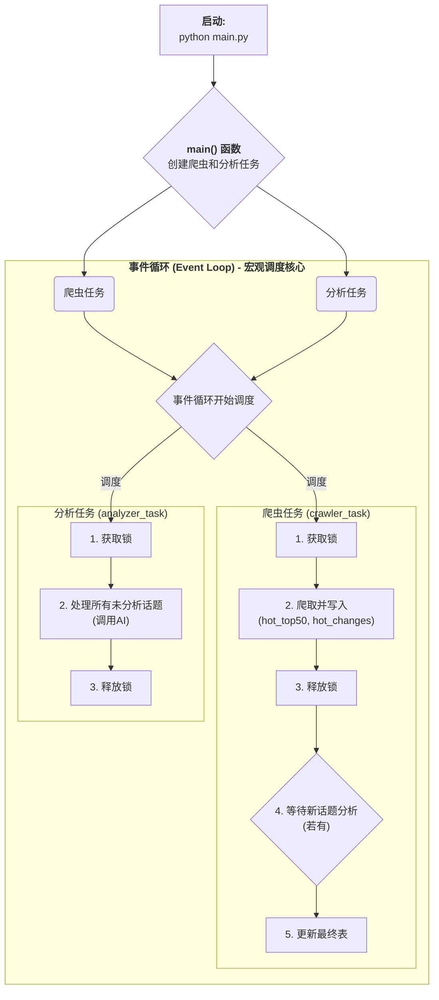

# 微博热搜实时分析脚本 (异步版)

[](https://www.python.org/) [](https://www.sqlalchemy.org/) [](https://docs.python.org/3/library/asyncio.html)

一个基于 Python `asyncio` 构建的高性能、异步的微博热搜榜监控和分析脚本。它采用生产者-消费者模型，能够 7x24 小时不间断地跟踪热搜变化，并将数据持久化到数据库中。同时，它还能调用大语言模型对新上榜的话题进行智能分析。

## ✨ 功能特性

- **异步核心**: 基于 `asyncio`、`httpx` 和 `SQLAlchemy (async)`，实现全链路异步，资源占用低，并发性能高。
- **生产者-消费者架构**: 爬虫 (`crawler`) 与分析器 (`analyzer`) 任务解耦，互不阻塞，系统稳定性和可扩展性强。
- **持久化存储**: 使用 `SQLAlchemy ORM` 将数据存储在 MySQL 数据库中，结构清晰，易于查询和维护。
- **智能分析**: 能够精确识别新上榜的话题，并调用大语言模型（DeepSeek）进行分析。
- **健壮的并发控制**: 通过数据库实现锁机制，确保爬虫和分析器在并发运行时数据操作的原子性和一致性。

## 🏛️ 系统架构

本项目采用经典的生产者-消费者模型，通过数据库进行解耦。

- **爬虫 (生产者)**: 定时从微博获取热搜榜数据，与数据库中现有数据进行比对，将"当前榜单"存入 `hot_top50` 表，将"新上榜"话题存入 `hot_changes` 表以待分析。
- **分析器 (消费者)**: 独立运行，持续检查 `hot_changes` 表中是否有未处理的新话题，并调用 AI 模型进行分析，将结果更新回数据库。
- **数据库**: 作为共享的"缓冲区"和最终的数据仓库。
- **事件循环**: `asyncio` 的事件循环作为总调度中心，协调所有异步任务。



## 🛠️ 技术栈

- **语言**: Python 3.8+
- **异步框架**: `asyncio`
- **HTTP 请求**: `httpx`
- **HTML 解析**: `BeautifulSoup4`
- **数据库 ORM**: `SQLAlchemy 2.0`
- **MySQL 驱动**: `aiomysql`

---

## 🚀 快速开始

### 1. 先决条件

- Python 3.8 或更高版本。
- 一个可用的 MySQL 数据库实例。
- 一个 DeepSeek API 密钥。

### 2. 环境安装

# 创建并激活虚拟环境 (推荐)
python -m venv venv
source venv/bin/activate  # macOS/Linux
# venv\Scripts\activate  # Windows

# 安装依赖
pip install -r requirements.txt
```

### 3. 项目配置 (关键步骤)

本项目的配置分为两步：

1.  **配置 AI 模型密钥**:
    - 本项目通过**环境变量**读取 `DEEPSEEK_API_KEY`。

2.  **配置微博 Cookie**:
    - 本项目需要将您的微博 Cookie **直接填入代码**中。

### 4. 运行程序

#### 初始化数据库
在首次运行前，执行此命令来自动创建数据库和表结构：
```bash
python main.py --init
```

#### 启动持续监控
一切就绪后，运行以下命令即可启动机器人：
```bash
python main.py
```
> 程序将开始持续运行，按 `Ctrl+C` 可以停止所有任务。

#### (可选) 一次性分析
如果您只想对当前数据库中未处理的话题进行一次性分析：
```bash
python main.py --one-time-analysis
```

## 📜 开源许可

本项目采用 [MIT License](LICENSE) 开源。